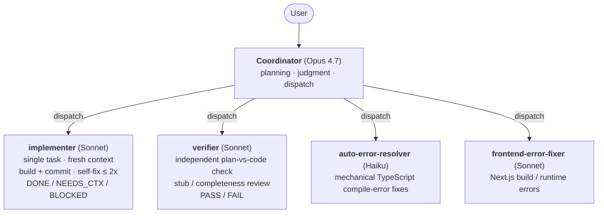
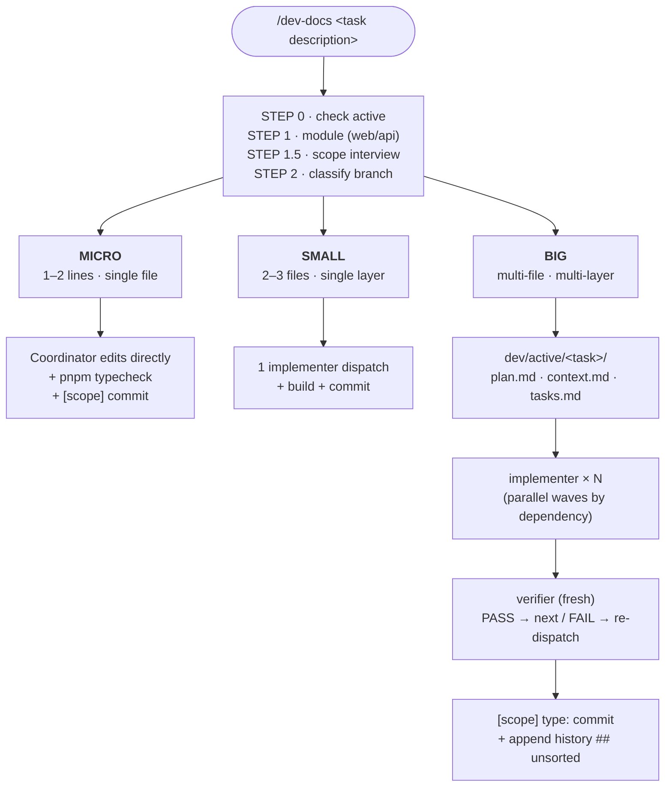

# my-small-harness

**A lightweight harness for adapting Claude Code to a personal development workflow on Next.js / React / TypeScript / pnpm projects.**

The Coordinator handles planning, judgment, and dispatch; the implementer / verifier / error fixer handle implementation, verification, and mechanical fixes in fresh contexts.
`/dev-docs` splits work into BIG / SMALL / MICRO so that simple edits stay light, while multi-file changes are handled through plan / context / tasks documents.

> This repo is not a general-purpose package or a team framework. It is a personal workflow experiment built from using Claude Code in real development work.
> The goal is not to hand design decisions over to AI, but to keep the developer responsible for problem definition and direction while using AI to accelerate execution, verification, and decision recording.

---

## Why I built it — from real usage

### 1. The trade-off between fresh context and retained task context

As a session got long, Claude's answer quality dropped noticeably. `/clear` recovered it via fresh context, but I had to re-explain previously agreed plans / decisions / progress.

→ Keep `plan.md`, `context.md`, and `tasks.md` as separate files under `dev/active/<task>/`, and re-inject only the necessary parts when starting from a fresh context. **Forget what can be safely forgotten; explicitly preserve only the context worth carrying forward.**

### 2. Fixing one thing broke something else that had been working

In the same module, a small change would sometimes break a seemingly unrelated feature. Without anything written down, I had to guess the impact range every time, and dependencies or invariant conditions that needed repeated checking were easy to miss. **But stuffing the entire module spec into every session's context consumed the token budget quickly.**

→ For modules where this happens often, add a `<module>/SPEC.md`. This file records the behavior spec and Invariants (dependency map · invariant conditions · conflict-detection rules). In a monorepo, once the target module is identified, `/dev-docs` injects **only that module's SPEC.md** into the dispatch `[CONTEXT]`, and the Coordinator also reads it from the pre-task checklist. Instead of carrying every spec at all times, the harness loads only the relevant module's spec when needed. **This follows the same principle as #1 (`/clear` + plan/context/tasks separation): keep only the context needed for the current task.**

### 3. I wanted the workflow to scale with task size

Existing AI coding harnesses were useful for complex tasks, but some of them still applied the same planning-heavy flow to 1–2 line fixes where the cause was already clear. For personal work, I wanted a workflow that could stay lightweight when the task was small.

→ `/dev-docs` first classifies a task as BIG / SMALL / MICRO. MICRO is handled directly by the Coordinator, SMALL goes through one implementer dispatch, and only BIG tasks go through the full plan / context / tasks pipeline.

### 4. Opus 4.7 for judgment, Sonnet/Haiku for execution

After splitting tasks across models in personal projects, I found that Sonnet was often sufficient for implementation work. Opus 4.7 provided more noticeable value in planning, task decomposition, dispatching work, and interpreting results than in writing code directly.

→ Coordinator focuses on planning, judgment, and dispatch; implementation, verification, and error fixes are delegated to separate agents. The aim is to split work by role, reduce cost, and keep the workflow stable.

### 5. For solo work, commits plus history notes were more practical than PRs

When Claude needed to undo work or refer back to previous changes, commits were the most useful unit of history. For solo work, however, opening and merging a PR for every change felt heavy relative to the records it left behind.

→ Commits record WHAT, while `history.md` records WHY · alternatives considered · failed attempts. `history.md` is treated as a working note rather than something to push, so it can be reused as context in the next session without polish overhead.

### 6. I wanted to enforce commits and history notes after a "done" report

Claude would sometimes report a task as complete but skip the commit, or make a commit and end the session without writing to `history.md`. In the next session, the reason behind the change was gone — `git log` alone made it hard to recover the surrounding judgment.

→ The Stop hook (`stop-commit-history-check.sh`) checks for both commit and history at session-end. If module code was modified without a commit, it blocks; if there is a commit but no history, it blocks once more. Since a Stop hook can only block once, a per-session state file works around that limit and verifies commit → history as two sequential stages.

---

## Core concepts

### Coordinator + subagent split

The main session, running on Opus 4.7, handles only **conversation, judgment, dispatch, and plan writing**. Actual coding, verification, and error fixes are delegated to separate fresh-context agents so the Coordinator context does not get polluted by build logs, grep output, and mechanical error traces.



Every subagent runs in a **fresh context**. When the Coordinator hands off work, it uses an explicit interface made of `[FILES]` / `[TASK]` / `[VERIFY]` / `[COMMIT]` blocks. Results come back as status codes, and the Coordinator branches based on the result matrix.

### /dev-docs lifecycle (BIG / SMALL / MICRO)

`/dev-docs <task>` → the skill classifies the task as BIG / SMALL / MICRO based on file count, whether new files are introduced, layer scope, requirement ambiguity, and the nature of the change.



> **STEP 1.5 scope interview (5 questions):** extending existing vs new · API change · adding external lib · data-fetching pattern · non-functional requirements

| Axis | BIG | SMALL | MICRO |
|------|-----|-------|-------|
| File count | 4+ | 2-3 | 1 (max 2) |
| New files | yes | 0-1 | none |
| Layers | API+UI+types | single | single file |
| Ambiguity | unclear requirements | clear | cause and fix both identified |
| Change kind | needs design | logic change | mechanical |

Full rules: [.claude/skills/dev-docs/SKILL.md](.claude/skills/dev-docs/SKILL.md).

### Two layers of records — commit vs history

| Layer | Location | Content | Audience |
|-------|----------|---------|----------|
| **commit** (pushed) | git log | `[scope] type: one-line summary` — WHAT | external collaboration · revert |
| **history** (`.gitignore`) | `dev/history/{scope}-history.md ## unsorted` | WHY · alternatives considered · failed attempts | AI context + personal working notebook |

Scope is auto-extracted by [`scope-for-staged.sh`](.claude/hooks/scope-for-staged.sh) from the top-level directory of staged files. If multiple modules are staged together, the commit is rejected so that the change unit gets split.

History is treated as a working-note layer, not a polished external document. By keeping it out of pushes, WHY · alternatives considered · failed attempts can be reused as context in the next session without cleanup pressure.

### scope-escalation hook

If you edit 3 or more files in the same module without `/dev-docs`, a PostToolUse hook stops the work and asks for `/dev-docs`. It detects when a small fix is growing into a multi-file change and nudges the workflow toward BIG.

### (Optional) Per-module `SPEC.md` for regression prevention

If "fixing one thing breaks another" keeps happening in the same module, start a `<module>/SPEC.md` from the [dev/templates/SPEC.md](dev/templates/SPEC.md) template. Write down the behavior spec, dependency map, invariants, and conflict-detection rules ahead of time, and when a `SPEC.md` exists in the module, `/dev-docs` auto-includes it in the dispatch `[CONTEXT]` so the implementer reads it before working. Recommended only for modules where regression risk is real — overkill for small modules.

---

## Usage

```
[session start] CLAUDE.md auto-loads; if there is WIP under dev/active/, resume

1. /dev-docs dark mode toggle
   → skill runs module + scope interview, classifies BIG/SMALL/MICRO
   → if BIG, auto-creates the 3 docs under dev/active/dark-mode-toggle/

2. "start from Phase 1"
   → Coordinator dispatches implementer
   → on completion, dispatches verifier
   → PASS → commit + history record

3. work done → all tasks.md checked → stop-clear-check suggests /clear
```

Frequent patterns:

```
"check PROJECT_KNOWLEDGE.md and dev/active/ and tell me current status"
"look at dev/active/<task>/ and continue from Phase 2"
"fix this error with auto-error-resolver"
```

---

## Scope and non-goals

**A productivity tool for solo development.** Team-collaboration features such as auto PR creation, code-review bots, and CI gating are non-goals for this repo. Those areas are better handled by GitHub-native tools or existing CI/CD setups.

This harness focuses on two gaps:

(a) role separation and repetitive-task automation when working with Claude Code  
(b) preserving the WHY · alternatives · failed attempts that `git log` alone cannot recover

**Stack assumption.** The harness patterns themselves — split / branch / hook / scope / history — are not strongly tied to any one stack. The agents and skills currently bundled, however, assume **Next.js / React / TypeScript / pnpm**. To apply this to a different stack, swap the internals of `auto-error-resolver` / `frontend-error-fixer` / `dev-docs` for that stack's build and verification tooling.

I split this repo out so I can reuse the workflow in future Next.js projects and show how I structure AI-assisted development in practice. Module names, scopes, and history mappings are placeholders (`web` / `api`), so adapt them to your actual project structure.

---

## Layout

```
.claude/
├── settings.json           # hook registration, permissions, statusline
├── agents/                 # subagents (implementer / verifier / error fixers)
├── hooks/                  # PreToolUse / PostToolUse / Stop / Notification + scope helper
├── rules/coordinator.md    # Coordinator operating rules
└── skills/dev-docs/        # /dev-docs skill (BIG/SMALL/MICRO branching + templates)
dev/
├── history/
│   ├── harness_history_generalized.md  # evolution log (reference doc)
│   └── TEMPLATE.md                      # template for starting a new module's history
└── templates/
    └── SPEC.md                          # (optional) per-module regression-prevention spec template
```

Only `dev-docs` is bundled under `.claude/skills/`. Stack-specific implementation guidelines depend heavily on project domain, so they are expected to be written separately per project.

`dev/active/` and `dev/done/` are gitignored. `/dev-docs` only creates the plan / context / tasks documents under `dev/active/<task>/` for tasks classified as BIG.

## Agents

| Agent | Default model | Role |
|-------|---------------|------|
| `implementer` | Sonnet | SMALL/BIG task implementation + build + commit |
| `verifier` | Sonnet | independent comparison of plan and actual code |
| `auto-error-resolver` | Haiku | mechanical fixes for TypeScript compile errors |
| `frontend-error-fixer` | Sonnet | Next.js / React build & runtime error diagnosis |

Detailed rules: [.claude/rules/coordinator.md](.claude/rules/coordinator.md).

## Hooks (registered in settings.json)

| Timing | File | Behavior |
|--------|------|----------|
| PreToolUse (Edit/Write) | `pre-env-protect.sh` | block edits to `.env*` |
| PostToolUse (Edit/Write/Bash) | `post-scope-escalation.sh` | require `/dev-docs` once 3 or more module files have been edited |
| PostToolUse (all tools) | `context-monitor.js` | warn when remaining context is low |
| Stop | `stop-clear-check.js` | suggest `/clear` once `tasks.md` is fully checked |
| Stop | `stop-commit-history-check.sh` | enforce commit + history record after module code edits (state machine) |
| statusLine | `context-statusline.js` | show model / task / context-remaining |

Helper: [`scope-for-staged.sh`](.claude/hooks/scope-for-staged.sh) — auto-extract `[scope]` from staged files.

---

## Initial setup

```bash
chmod +x .claude/hooks/*.sh
```

No separate install step is required. The Node hooks use only built-in modules (`fs`, `path`, `os`).

After copying this into a project:

1. **Module mapping — only [.claude/hooks/modules.conf.sh](.claude/hooks/modules.conf.sh)**
   - Default placeholders: `web/`, `api/`. Replace with your directory structure.
   - `MODULES_PATTERN` (regex) / `dir_to_scope` (commit prefix) / `scope_to_history` (file path) are all managed in this single file.
2. Create `dev/history/{module}-history.md` — copy the template instead of starting empty:
   ```bash
   cp dev/history/TEMPLATE.md dev/history/web-history.md
   cp dev/history/TEMPLATE.md dev/history/api-history.md
   ```
   (if missing, the stop hook fails)
3. **Check permission mode** — [`.claude/settings.json`](.claude/settings.json) prioritizes personal workflow speed by allowing `acceptEdits` and `Bash:*` broadly. If you want to start more conservatively, switch `defaultMode` to `default`.

### Commit flow

```bash
SCOPE=$(.claude/hooks/scope-for-staged.sh) || exit 1
git commit -m "[$SCOPE] feat: one-line summary"
```

The stop hook enforces the `[scope] type: ...` format. If the prefix is missing it rejects and prints the amend command.

### Tracking the harness itself (optional)

By default, `.claude/` itself is excluded from tracked modules. This prevents the hooks from blocking harness-configuration changes immediately after the files are copied into a new project.

Once your workflow stabilizes and you want to record changes to the harness itself, add a `\.claude` pattern, a `harness` scope, and the corresponding history-file mapping in `modules.conf.sh`.

---

## Evolution log

[dev/history/harness_history_generalized.md](dev/history/harness_history_generalized.md) documents the decisions, alternatives considered, and abandoned approaches behind this harness.

## License

MIT
