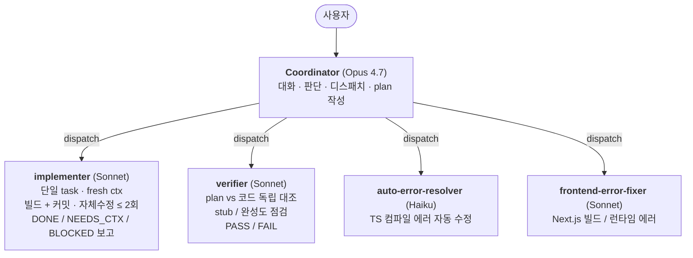
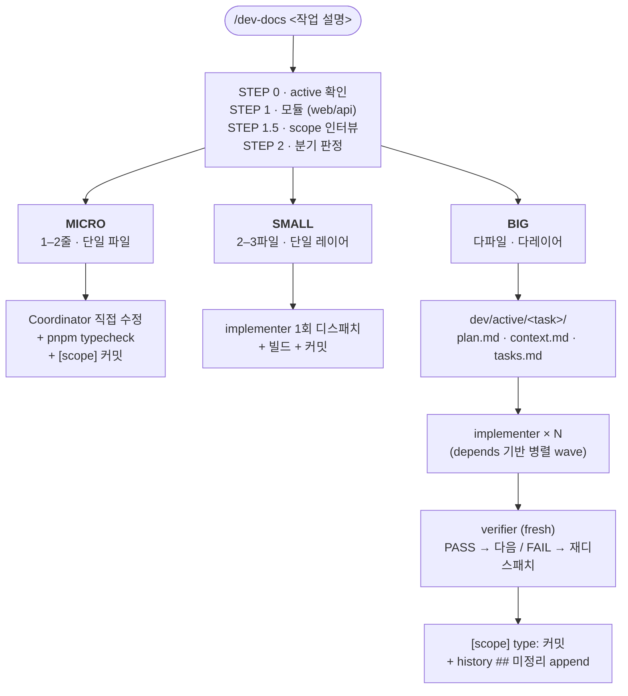

# my-small-harness

> [!NOTE]
> **A lightweight harness for adapting Claude Code to a personal development workflow on Next.js / React / TypeScript / pnpm projects.**
>
> Coordinator handles planning, judgment, and dispatch; implementer / verifier / error fixer handle implementation, verification, and mechanical fixes in fresh contexts.
> `/dev-docs` splits work into BIG / SMALL / MICRO so that simple edits stay light, while multi-file changes are handled through plan / context / tasks documents.
>
> For English version, see [README.en.md](README.en.md).

**Next.js / React / TypeScript / pnpm 프로젝트에서 Claude Code를 개인 개발 workflow에 맞게 쓰기 위해 만든 lightweight harness.**

Coordinator는 계획·판단·디스패치를 맡고, implementer / verifier / error fixer는 fresh context에서 구현·검증·기계적 수정을 담당한다.
`/dev-docs`는 작업을 BIG / SMALL / MICRO로 나눠, 단순 수정은 가볍게 처리하고 다파일 변경은 plan / context / tasks 기반으로 진행하도록 돕는다.

> 이 repo는 범용 패키지나 팀용 프레임워크가 아니라, 제가 Claude Code를 실제 개발에 사용하면서 만든 개인용 workflow 실험이자 포트폴리오용 정리입니다.
> 핵심 목적은 AI가 설계를 대체하게 하는 것이 아니라, 개발자가 문제 정의와 수정 방향을 유지한 상태에서 실행·검증·기록을 가속하는 것입니다.

---

## 만든 이유 — 실사용 경험에서

### 1. Fresh context와 작업 기억 사이의 trade-off

세션이 길어지면 Claude 답변 품질이 눈에 띄게 떨어졌다. `/clear`로 fresh context를 만들면 회복됐지만, 이전에 합의한 plan / 결정 / 진행 상태를 다시 설명해야 했다.

→ `dev/active/<task>/` 아래에 `plan.md`, `context.md`, `tasks.md`를 분리해 두고, fresh context 시작 시 필요한 정보만 다시 주입한다. **잊어도 되는 건 잊고, 보존할 가치 있는 것만 명시적으로 재사용한다.**

### 2. 모델 분업 — 고비용 모델은 판단에, 저비용 모델은 반복 작업에

개인 프로젝트에서 여러 작업을 나눠 맡겨본 결과, 실제 구현은 Sonnet으로도 충분한 경우가 많았다. 반면 Opus는 직접 코드를 오래 작성하는 것보다 plan 작성, 작업 분해, dispatch, 결과 해석에서 더 큰 체감 이점이 있었다.

→ Coordinator는 계획·판단·디스패치에 집중하고, 구현·검증·TS 에러 수정은 별도 에이전트에 맡겼다. 모델을 역할별로 나눠 비용을 줄이면서도 작업 흐름의 안정성을 유지하는 것이 목표였다.

### 3. 솔로 작업에서는 commit + history 기록이 더 실용적이었다

Claude가 revert하거나 변경 이력을 참조할 때는 commit 단위가 가장 유용했다. 반면 개인 작업에서 매번 PR을 만들고 머지하는 흐름은 기록 대비 절차가 무겁게 느껴졌다.

→ commit은 WHAT을 남기고, `history.md`는 WHY · 검토한 대안 · 실패한 시도를 남기는 역할로 분리했다. `history.md`는 push 대상이 아닌 working note로 두어, 정제 부담 없이 다음 세션의 context로 재사용할 수 있게 했다.

### 4. 작업 크기에 따라 workflow 무게를 다르게 가져가고 싶었다

기존 AI coding harness들은 복잡한 작업에는 유용했지만, 원인이 명확한 1–2줄 수정에도 동일한 planning 절차가 도는 경우가 있었다. 개인 작업에서는 작업 크기에 따라 더 가볍게 시작할 수 있는 분기가 필요했다.

→ `/dev-docs`가 BIG / SMALL / MICRO를 먼저 판정한다. MICRO는 Coordinator가 직접 처리하고, SMALL은 implementer 1회, BIG만 plan / context / tasks 기반의 풀 파이프라인으로 진행한다.

### 5. 완료 보고 이후 commit / history 누락을 막고 싶었다

Claude가 작업 완료를 보고한 뒤 commit을 빠뜨리거나, commit만 하고 `history.md` 기록을 누락한 채 세션을 끝내는 경우가 있었다. 다음 세션에서 보면 "이 변경을 왜 했는지"가 사라져 있었고, `git log`만으로는 판단 맥락을 복원하기 어려웠다.

→ Stop hook (`stop-commit-history-check.sh`)으로 세션 종료 시점에 commit과 history 기록을 확인한다. 모듈 코드 수정 후 commit이 없으면 차단하고, commit은 있지만 history가 없으면 한 번 더 차단한다. Stop hook의 1회 차단 한계는 세션별 state 파일로 우회해 두 단계 순차 확인이 가능하게 했다.

### 6. 한 곳을 수정하면 다른 곳이 조용히 깨지는 일이 반복됐다

같은 모듈에서 작은 수정 한 번에 무관해 보이던 다른 기능이 회귀하는 경우가 있었다. 매번 영향 범위를 머릿속에서 추측해 작업하다 보니 빠뜨림이 잦았다.

→ 회귀가 잦은 모듈에 한해 `<module>/SPEC.md`(선택)에 동작 명세와 Invariants(의존성 맵 · 불변 조건 · 충돌 감지 규칙)를 미리 적어둔다. `/dev-docs`가 디스패치 `[CONTEXT]`에 자동 포함시키고, Coordinator도 작업 시작 전 체크리스트에서 같이 읽는다. 모든 분기(MICRO/SMALL/BIG)에서 같은 정보 위에서 판단하도록 만든 것이 목적이다. 템플릿: [dev/templates/SPEC.md](dev/templates/SPEC.md).

---

## 핵심 컨셉

### Coordinator + 서브에이전트 분업

메인 세션(Opus)은 **대화·판단·디스패치·plan 작성**만. 실제 코딩·검증·에러 수정은 fresh context 의 별도 에이전트로 분리. Coordinator context 를 빌드 로그/grep 결과로 더럽히지 않기 위함.



각 서브에이전트는 **fresh context** 로 받음. Coordinator 가 인계 시 `[FILES]` / `[TASK]` / `[VERIFY]` / `[COMMIT]` 블록으로 명시적 인터페이스. 결과는 상태코드로 회신 → Coordinator 가 매트릭스대로 분기.

### /dev-docs 라이프사이클 (BIG / SMALL / MICRO)

`/dev-docs <작업>` → 스킬이 파일 수 · 새 파일 여부 · 레이어 범위 · 요구사항 모호성 · 변경 성격을 기준으로 BIG / SMALL / MICRO를 판정한다.



> **STEP 1.5 scope 인터뷰 (5문항):** 기존 확장 vs 신규 · API 변경 · 외부 lib 추가 · 데이터 페칭 패턴 · 비기능 요구

| 축 | BIG | SMALL | MICRO |
|----|-----|-------|-------|
| 파일 수 | 4개+ | 2-3개 | 1개 (max 2) |
| 새 파일 | 있음 | 0-1개 | 없음 |
| 레이어 | API+UI+타입 | 단일 | 단일 파일 |
| 모호함 | 요구사항 불명확 | 명확 | 원인+수정 모두 특정 |
| 변경 성격 | 설계 필요 | 로직 변경 | 기계적 |

자세한 룰은 [.claude/skills/dev-docs/SKILL.md](.claude/skills/dev-docs/SKILL.md).

### 두 층 기록 — commit vs history

| 층 | 위치 | 내용 | 청중 |
|----|------|------|------|
| **commit** (push) | git log | `[scope] type: 한국어 한 줄` — WHAT 요약 | 외부 협업·revert |
| **history** (`.gitignore`) | `dev/history/{scope}-history.md ## 미정리` | WHY · 검토한 대안 · 실패한 시도 | AI 컨텍스트 + 본인 working notebook |

scope는 [`scope-for-staged.sh`](.claude/hooks/scope-for-staged.sh)가 staged 파일의 top-level directory에서 자동 추출한다. 다중 모듈이 함께 staged된 경우에는 커밋을 거부해 변경 단위를 분리하도록 만든다.

history는 정제된 외부 문서가 아니라, 부담 없이 남기는 working note 계층으로 둔다. push 대상에서 분리해 WHY · 검토한 대안 · 실패한 시도를 다음 세션의 context로 재사용할 수 있게 했다.

### scope-escalation hook

`/dev-docs` 없이 같은 모듈의 파일을 3개 이상 편집하면 PostToolUse hook이 작업을 중단시키고 `/dev-docs` 사용을 요구한다. 작은 수정으로 시작한 작업이 다파일 변경으로 커지는 상황을 감지해, BIG workflow로 전환하도록 만든다.

### (선택) 모듈별 `SPEC.md`로 회귀 방지

같은 모듈에서 "한 곳을 수정하니 다른 곳이 깨졌다"가 반복되면 `<module>/SPEC.md`를 [dev/templates/SPEC.md](dev/templates/SPEC.md) 템플릿으로 시작. 동작 명세 + 의존성 맵 + 불변 조건 + 충돌 감지 규칙을 미리 적어두면, 모듈에 SPEC.md가 존재할 때 `/dev-docs`가 디스패치 `[CONTEXT]`에 자동 포함시켜 implementer가 작업 전에 읽는다. 회귀 위험이 큰 모듈에만 권장 — 작은 모듈엔 과잉.

---

## 사용법

```
[세션 시작] CLAUDE.md 자동 로드, 진행 중인 `dev/active/` 작업이 있으면 이어서 진행

1. /dev-docs 다크모드 토글
   → 스킬이 모듈 + scope 인터뷰 + BIG/SMALL/MICRO 판정
   → BIG 이면 dev/active/dark-mode-toggle/ 3종 자동 생성

2. "Phase 1 부터 시작해줘"
   → Coordinator 가 implementer 디스패치
   → 완료 후 verifier 디스패치
   → PASS → commit + history 기록

3. 작업 끝 → tasks.md 전부 체크 → stop-clear-check 가 /clear 추천
```

자주 쓰는 패턴:

```
"PROJECT_KNOWLEDGE.md 랑 dev/active/ 확인하고 현재 상태 알려줘"
"dev/active/<task>/ 보고 Phase 2 부터 이어서 진행해"
"이 에러 auto-error-resolver 로 고쳐줘"
```

---

## Scope 명시 — out of scope

**솔로 개발자를 위한 productivity tool.** 팀 협업에 필요한 PR 자동 생성, 코드리뷰 봇, CI gating은 이 repo의 범위가 아니다. 그런 영역은 GitHub native 도구나 기존 CI/CD 도구가 더 잘 담당한다.

이 harness가 채우려는 빈자리는 두 가지다.
(a) Claude Code와 일할 때의 역할 분리와 반복 작업 자동화
(b) `git log`만으로 복원하기 어려운 WHY · 대안 · 실패한 시도 보존

**스택 전제.** harness의 패턴 자체, 즉 분업 · 분기 · hook · scope · history 구조는 특정 스택에 강하게 묶이지 않는다. 다만 현재 포함된 에이전트와 스킬은 **Next.js / React / TypeScript / pnpm**을 전제로 한다. 다른 스택에 적용하려면 `auto-error-resolver` / `frontend-error-fixer` / `dev-docs` 내용을 해당 스택의 빌드·검증 도구에 맞게 바꾸면 된다.

이 repo는 다음 Next.js 프로젝트에서도 재사용할 수 있도록 개인 workflow를 분리한 것이며, 동시에 AI-assisted development를 어떻게 구조화했는지 보여주는 포트폴리오 목적도 있다. 모듈명 · scope · history 매핑은 placeholder (`web` / `api`)이므로, 실제 프로젝트 구조에 맞게 수정해야 한다.

---

## 구성

```
.claude/
├── settings.json           # hook 등록, 권한, statusline
├── agents/                 # 서브에이전트 (implementer / verifier / 에러 픽서)
├── hooks/                  # PreToolUse / PostToolUse / Stop / Notification + scope helper
├── rules/coordinator.md    # Coordinator 운영 규칙
└── skills/dev-docs/        # /dev-docs 스킬 (BIG/SMALL/MICRO 분기 + 템플릿)
dev/
├── history/
│   ├── harness_history_generalized.md  # 진화 기록 (참고용 reference doc)
│   └── TEMPLATE.md                      # 새 모듈 history 시작용 템플릿
└── templates/
    └── SPEC.md                          # (선택) 모듈 회귀 방지용 spec 템플릿
```

`.claude/skills/`에는 `dev-docs`만 포함했다. 스택별 구현 가이드라인은 프로젝트 도메인 의존성이 커서, 새 프로젝트마다 별도로 작성하는 것을 전제로 한다.

`dev/active/`, `dev/done/`은 `.gitignore` 대상이다. `/dev-docs`가 BIG으로 판정한 작업만 `dev/active/<task>/` 아래에 plan / context / tasks 문서를 생성한다.

## 에이전트

| 에이전트 | 기본 모델 | 역할 |
|---------|-----------|------|
| `implementer` | Sonnet-class | SMALL/BIG 태스크 구현 + 빌드 + 커밋 |
| `verifier` | Sonnet-class | plan과 실제 코드의 독립 대조 |
| `auto-error-resolver` | Haiku-class | TypeScript 컴파일 에러의 기계적 수정 |
| `frontend-error-fixer` | Sonnet-class | Next.js / React 빌드·런타임 에러 진단 |

자세한 규칙은 [.claude/rules/coordinator.md](.claude/rules/coordinator.md).

## Hook (settings.json 등록)

| 타이밍 | 파일 | 동작 |
|--------|------|------|
| PreToolUse (Edit/Write) | `pre-env-protect.sh` | `.env*` 편집 차단 |
| PostToolUse (Edit/Write/Bash) | `post-scope-escalation.sh` | 모듈 파일 3개+ 편집 시 `/dev-docs` 강제 |
| PostToolUse (모든 툴) | `context-monitor.js` | context 잔량 낮으면 경고 주입 |
| Stop | `stop-clear-check.js` | `tasks.md` 전부 체크되면 `/clear` 추천 |
| Stop | `stop-commit-history-check.sh` | 모듈 코드 수정 시 commit + history 기록 강제 (state machine) |
| statusLine | `context-statusline.js` | 모델 / 작업 / context 잔량 표시 |

추가 헬퍼: [`scope-for-staged.sh`](.claude/hooks/scope-for-staged.sh) — staged 파일에서 `[scope]` 자동 추출.

---

## 초기 설정

```bash
chmod +x .claude/hooks/*.sh
```

별도 설치 없음. node hook 들은 built-in 모듈(`fs`, `path`, `os`)만 사용.

복사해온 직후 할 것:

1. **모듈 매핑 — [.claude/hooks/modules.conf.sh](.claude/hooks/modules.conf.sh) 한 군데만**
   - 기본 placeholder: `web/`, `api/`. 본인 디렉토리 구조에 맞게 교체.
   - `MODULES_PATTERN` (정규식) / `dir_to_scope` (커밋 prefix) / `scope_to_history` (파일 경로) 셋 다 한 파일에서 관리.
2. `dev/history/{module}-history.md` 생성 — 빈 파일 대신 템플릿 복사 권장:
   ```bash
   cp dev/history/TEMPLATE.md dev/history/web-history.md
   cp dev/history/TEMPLATE.md dev/history/api-history.md
   ```
   (없으면 stop hook 이 fail)
3. **권한 모드 확인** — [`.claude/settings.json`](.claude/settings.json)은 개인 작업 속도를 우선해 `acceptEdits`와 `Bash:*`를 넓게 허용한다. 더 보수적으로 시작하려면 `defaultMode`를 `default`로 바꾸는 것을 권장한다.

### 커밋 흐름

```bash
SCOPE=$(.claude/hooks/scope-for-staged.sh) || exit 1
git commit -m "[$SCOPE] feat: 한국어 한 줄"
```

stop hook 이 `[scope] type: ...` 형식 강제. prefix 누락 시 reject + amend 명령 제시.

### harness 자체 추적 활성화 (선택)

기본값에서는 `.claude/` 자체를 추적 대상에서 제외한다. 새로 복사한 직후 hook이 harness 설정 변경까지 차단하는 상황을 피하기 위해서다.

워크플로가 안정화된 뒤 harness 자체 변경도 기록하고 싶다면 `modules.conf.sh`에 `\.claude` 패턴, `harness` scope, 그리고 대응되는 history 파일 매핑을 추가하면 된다.

---

## 진화 기록

[dev/history/harness_history_generalized.md](dev/history/harness_history_generalized.md)에는 이 harness를 만들면서 남긴 의사결정 흐름, 검토한 대안, 폐기한 접근을 정리했다.

## License

MIT
